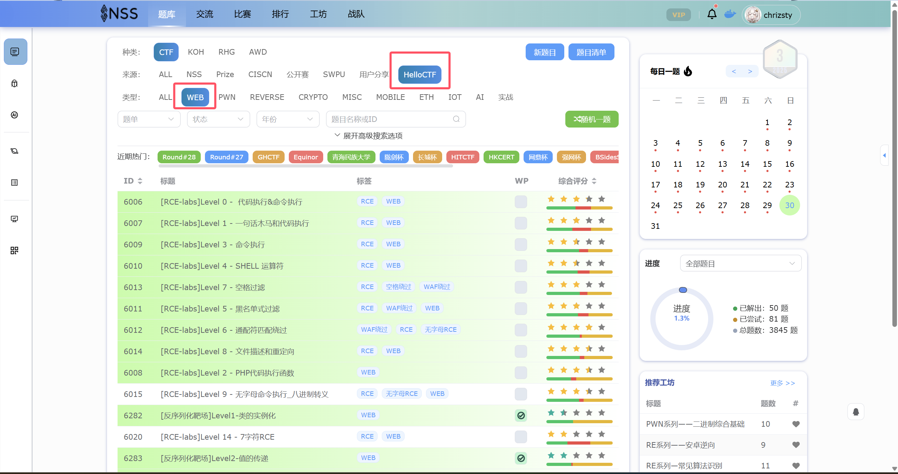

# 第四周

### 主要任务

开始学习php反序列化，这是一个刚开始学比较难的一部分，这里推荐两篇文章：

1. [Hello-ctf](https://hello-ctf.com/hc-web/php_unser_base/)
2. [[php反序列化从入门到放弃(入门篇) - bmjoker - 博客园]](https://www.cnblogs.com/bmjoker/p/13742666.html)：这是一篇跨度很大的文章，学有余力可以尝试学完，如果困难可以先把pop链构造学完

题目部分：

1. 跟着第二篇文章里，自己把demon做一做
2. 做完php反序列化靶场（很基础），知识点也对应上面两篇文章
   * 你可以在nss里找到这个靶场
     
   * 也可以自行搭建靶场[[PHPSerialize-labs]](https://github.com/ProbiusOfficial/PHPSerialize-labs)

### 学有余力

1. 可以往后学习第二篇文章的后面
2. 开始学习ssti的相关知识[【ssti基础】](https://hello-ctf.com/hc-web/ssti/)

