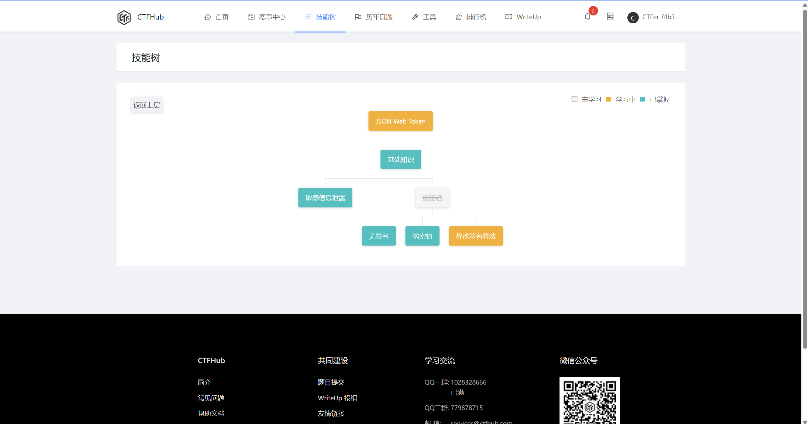

# 第八周

### 主要任务

学两个简单点的洞**XXE漏洞**

这里还是推荐两篇文章学习：[【XXE漏洞详解】](https://blog.csdn.net/qq_61553520/article/details/130565993)，[【从一道题目学习XXE漏洞】](https://blog.csdn.net/qq_38154820/article/details/114265527)

另一个是  **JWT**(JSON Web Token)

## 题目

1. 【XXE】[GHCTF 2025(>﹏<)](https://www.nssctf.cn/problem/6578)

2. 学完ctf-hub的jwt板块，`学习`->`web进阶`->`JSON Web Token`（最后一个不会可以放一下）

